# Kong API Gateway with Fast API, Open Telemetry and Open Observe in Docker

## Architecture
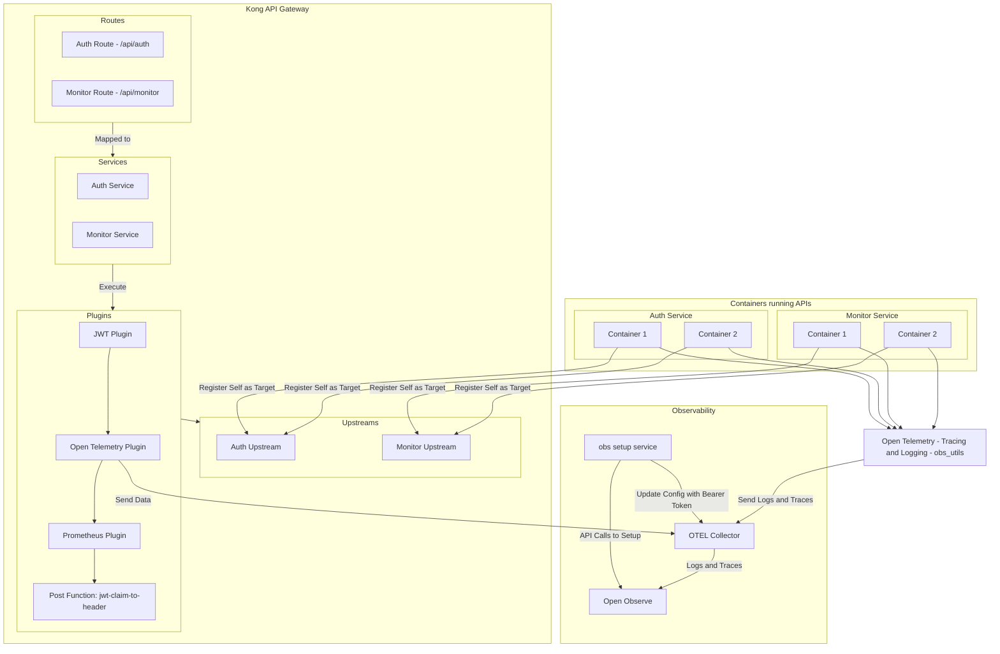

## Docker Compose Overview

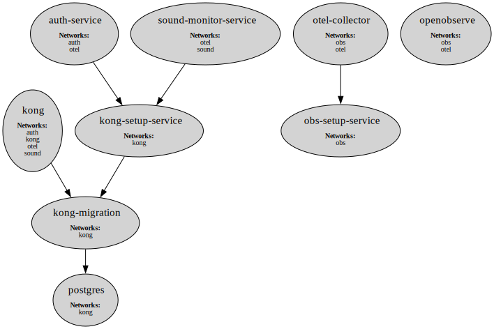


## Auth Request Flow
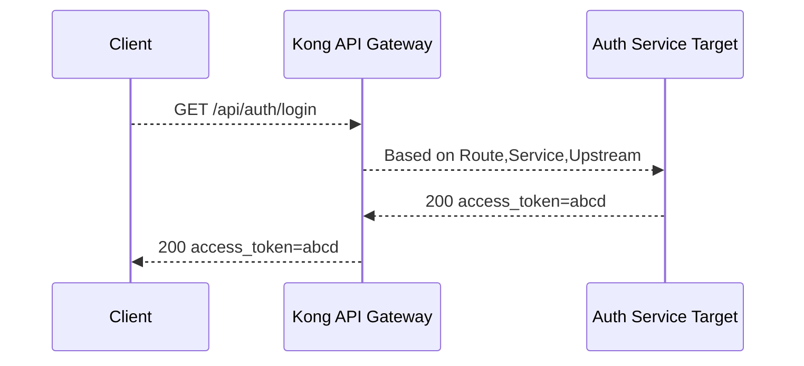

## Sound Monitor Request Flow
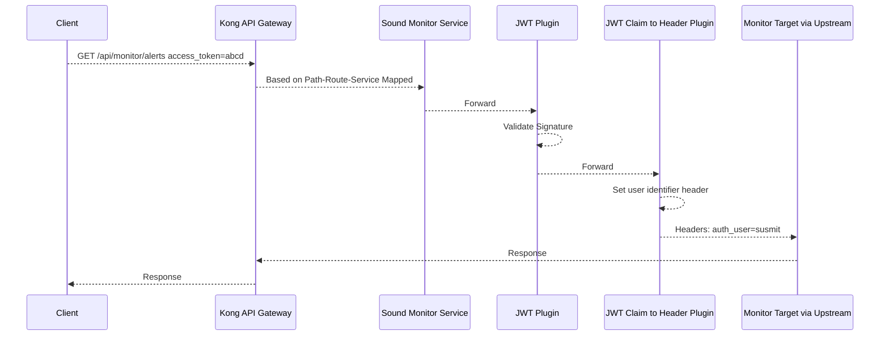


## Description
The purpose of this project is to help understand about various technologies and concepts within a microservices architecture, particularly the flow of interaction and how components work together. This repo also serves as an example which showcases usage of observability (in particular logs and traces).  Towards the end of the README one can find examples with images.

## Tech Stack
- Open Observe for tracing, logging and metrics analysis
- OTEL Collector as a single point of collection
- Kong API Gateway for API management
- Various plugins in Kong Gateway such as JWT, Open Telemetry, Prometheus, Serverless Post Function
- Postgres for the database (used by Kong)
- Docker and Docker Compose for containerisation and getting the containers to work together
- Python - FastAPI based services for authentication and a dummy service named sound monitor
- Shell script based approach for registering targets dynamically for Kong API Gateway Upstreams

`Micro Services.postman_collection.json` demonstrates the API usage via Kong. To use it create an environment in Postman with the following details:
```
gateway_auth_host=http://localhost:8000/api/auth
gateway_sound_monitor_host=http://localhost:8000/api/monitor
```

It showcases various concepts with examples, among others such as:
* How Kong routes to individual services based on path
* Round robin being used for load balancing


## Setup
- Run `python clean_up.py` to delete any existing mapped volumes (postgres and openobserve) and start afresh
- Run `sh setup.sh` to move the files from `common` directory to various directories
- Spin up the services using `docker-compose up -d`

## Components

### Observability
`obs-setup-service` is used to do the setup required for open-observe and configuring `otel-collector` with the necessary authentication token.

The below illustrates the setup flow:
- Open Observe Starts
- obs setup service runs a python script that
    - Waits for the Open Observe to start
    - Updates the organization parameters such as field names of trace id and span id via the Open Observe API
    - Fetches the passcode and puts together the authorization bearer token for the OTEL Collector to use
    - Updates the OTEL Collector configuration file with the authorization bearer token
- OTEL Collector starts after obs setup service successfully completes

### Kong API Gateway
`kong-setup-service` is used to create various upstreams, services and routes. It is also used to install the plugins demonstrating a robust automated approach.

The below illustrates the setup flow:
- Postgres starts which is used by Kong. A health check is configured for the Postgres service.
- Kong migrations are run when postgres service is healthy. Note: For reproducibility, this is included in the docker compose file. Ideally this needs to be done only once at the start
- kong setup service runs a python script that
    - Waits for the Kong to start
    - Creates the upstreams
	    - The upstreams are configured with both active and passive health checks.
	    - Each of the API service is configured in a different network to prevent overlapping IP addresses to avoid the following edge case: Instance registers itself as Service A => Instance goes down => marked as unhealthy => a instance of Service B spins up having the same IP address => marked as healthy . This will lead to Kong routing requests meant for Service A to Service B
    - Creates the services with the corresponding upstreams names
    - Creates the routes that map to the services
    - Installs and Setups The Plugins
        * JWT Plugin
           - Installed for specific services 
           - This plugin is used to check the signature of the JWT token
           - It also validates the token expiry via the claim `exp`
           - For this a consumer is created and a credential consisting of the issuer's key and the JWT secret key is created which the auth service will use to create the JWT token
        * Post Function: jwt-claim-to-header
            - Installed for specific services 
            - This uses the Kong's serverless post function plugin which runs after all the plugins have run
            - This contains custom lua script that extracts the claim `sub` (set by auth service) from the JWT token and sets it as a header `auth-user-identifier`, which can be accessed by the downstream services to identify the user 
        * Open Telemetry Plugin
            - Installed as a global plugin
            - The logs and traces endpoints are configured to send the spans and logs to the OTEL Collector
    - Enabling tracing
        - The tracing is enabled by setting the `KONG_TRACING_INSTRUMENTATIONS` environment variable which overrides the default value in `kong.conf`
        - For demonstration purpose `KONG_TRACING_SAMPLING_RATE` is set to 1 which means all traces are sent to the OTEL Collector. In production, this should be set as per the requirements.
        - The tracing is captured by the Open Telemetry plugin and sent to the OTEL Collector

### Dynamic Target Registration
`register_service.sh` is executed for the API services such as `auth-service` and `sound-monitor-service`. It uses the Kong Admin API to register the targets. Since multiple networks are attached and the docker services get multiple IP addresses (one for each network), the prefix passed in docker compose entrypoint command is used to decide the IP address to use to register with Kong

### Observability in API Services
* `obs_utils.py` contains the code to configure the required tracing and logging setup. 
* The log enricher `TraceEnricher` as well as the function  `set_request_attributes` used as a decorator ensure that all traces and logs have all the required attributes for debugging and analytics.   
* The API endpoint `alerts` in  `sound-monitor-service/src/app.py` demonstrates the use of logging, nested spans as well as adding events to spans.   
* Auto instrumentation is purposefully commented out in `create_app.py`
* The below allows for granular control over which levels of logs are emitted in console and which make it to the observability service. 
```python
logger_level = getattr(logging, os.environ.get("LOGGER_LEVEL", "INFO"))
console_level = getattr(logging, os.environ.get("CONSOLE_LOG_LEVEL", "INFO"))
otel_level = getattr(logging, os.environ.get("OTEL_LOG_LEVEL", "INFO"))
```

## Outputs

The below spans and logs are emitted on invoking GET /alerts.

### Log in console
```
2025-03-23 16:31:22.788 - sound-service - [trace_id=ff6e91b0925ac339aa8e4f41b6db1a08 span_id=b6834ad72bdb017e request_id=c24161015e49454e861f122fa0094252 user=susmit] - INFO - Fetching alerts
```

### In Open Observe
### Log
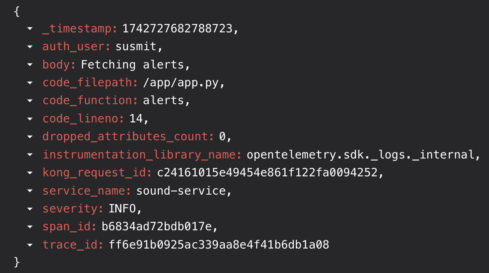

### Trace generated by Kong as well as the API service
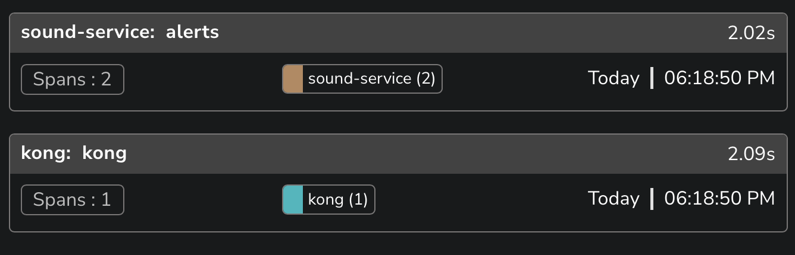

### Trace generated by Kong
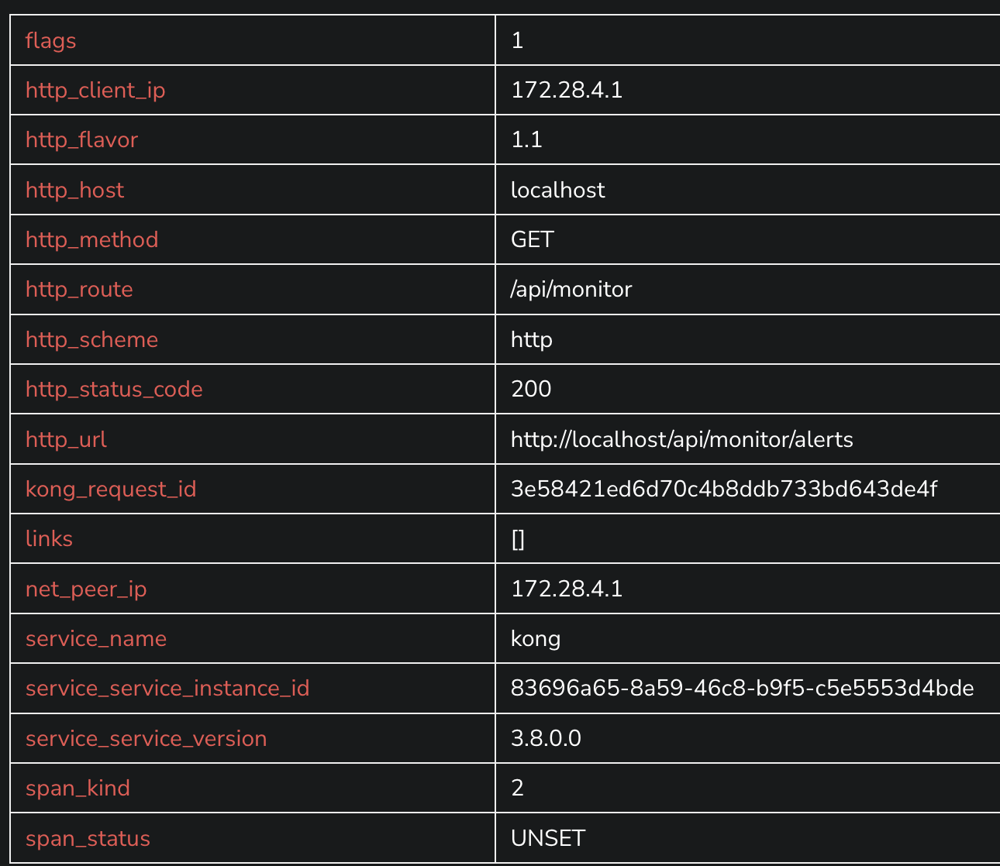

### Distribution of the total time taken
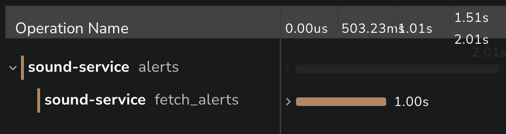

### Attributes of Span
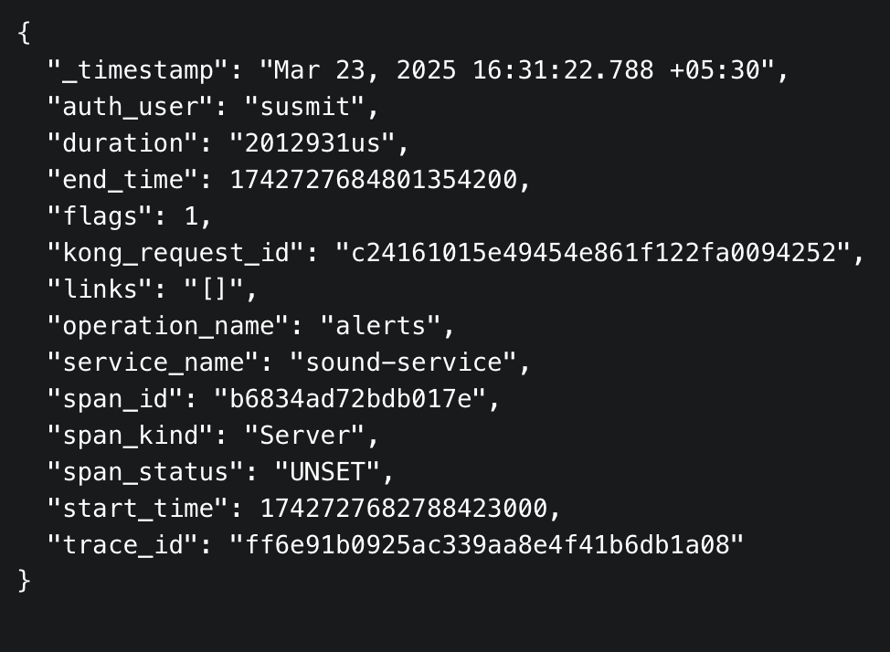

### Event(s) associated with the nested span
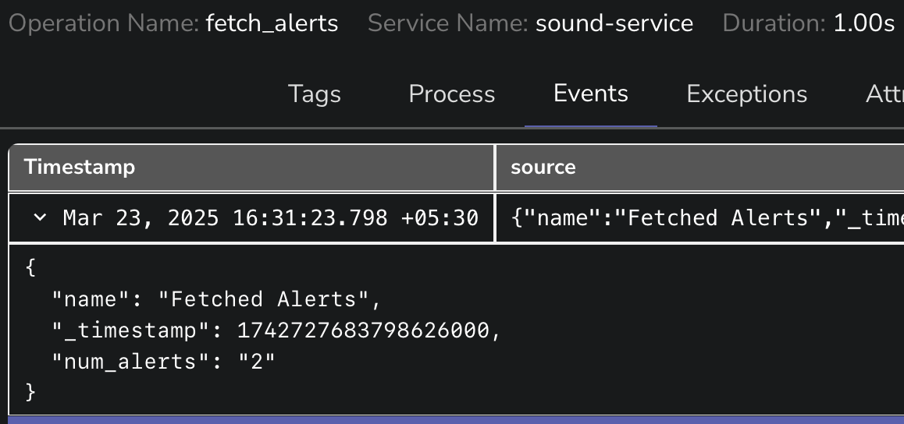

### Installed Plugins
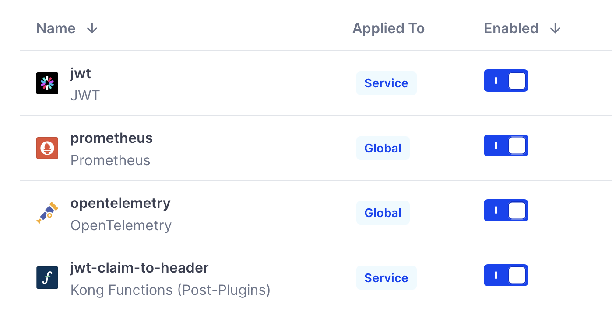